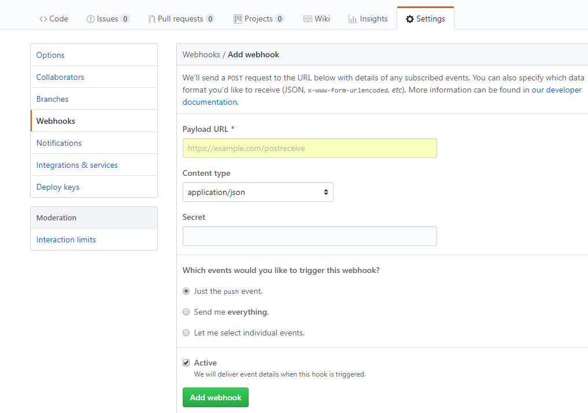

# 1.测试url（已测试的是git后端和文件系统后端）

/{application}/{profile}[/{label}]
/{application}-{profile}.yml
/{label}/{application}-{profile}.yml
/{application}-{profile}.properties
/{label}/{application}-{profile}.properties

http://localhost:8017/foo/development

# 2.webhook(通过web调用的钩子)

    例如gitHub的webHook
    secret是签名的key，github使用key对payload签名，你的服务使用secret签名比对
    GitHub使用HMAC hexdigest来计算哈希值

